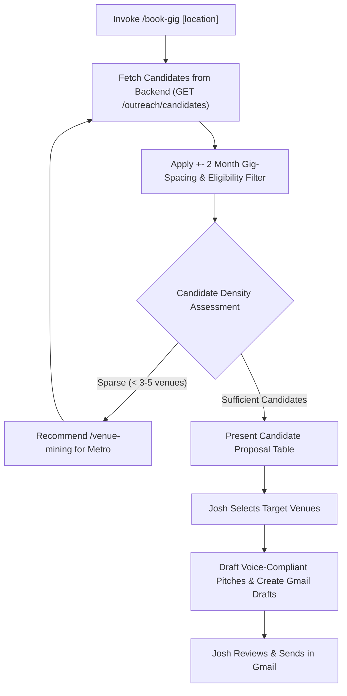

# book-gig — Target Performance Weekend Booking Outreach

Automate identifying eligible live-music venues, filtering them against Josh & Maria's performance history (+- 2 months gig-spacing), triggering `venue-mining` when target density is low, generating personalized booking pitches that adhere to `docs/cross-ai-rules.md` voice rules, and creating Gmail drafts for Josh's review.

## Invocation

- `/book-gig <weekend> [location]`
- **Examples:**
  - `/book-gig Oct 16-18 2026` — sweep all venues across the regional driving radius (~3.5h from Salem, VA).
  - `/book-gig Oct 16-18 2026 Lynchburg, VA` — focus on Lynchburg, VA and surrounding area.
  - `/book-gig Oct 16-18 2026 24502` — focus on zipcode 24502.
  - `/book-gig 2026-10-16` — ISO date format (defaults Friday–Sunday span).
- **Interactive Fallback:** If invoked without arguments (`/book-gig`), prompt Josh interactively for the target weekend and optional location.

## Workflow

### 1. Resolve Target Weekend & Location
- Parse natural date ranges (`Oct 16-18 2026`) or ISO strings (`2026-10-16`).
- Parse optional location (City/State e.g. `Lynchburg, VA`, Zipcode e.g. `24502`, or metro slug).

### 2. Candidate Discovery & Gig-Spacing Exclusion
- Calls `web-jam-back` `GET /outreach/candidates?targetDates=...`:
  - Automatically filters to `outreachEligible !== false` venues with valid contact email.
  - Excludes venues that already have active outreach campaigns for the requested weekend.
  - Enforces the **+- 2 month gig-spacing rule** (`excludeUpcomingGigVenues`): excludes any venue where Josh & Maria are performing within 60 days of the target weekend.
  - Sorts and prioritizes venues matching the requested City, State, or Zipcode.

### 3. Density Check & Venue Mining Trigger
- If candidate coverage in the target area is sparse (< 3–5 venues), the skill offers to run `/venue-mining metro <slug>` to harvest net-new venues first.
- New venues are added to MongoDB with verified street addresses and booking emails via `POST /venue`.

### 4. Propose Candidate Table
- Present a phone-readable table to Josh in chat:
  `| # | Venue Name | City, State | Booking Email | Spacing Reason |`
- Josh approves the target list (e.g. "all", "1, 2, 4", or "skip X").

### 5. Pitch Drafting, Gmail Drafts & Responsive HTML Review Artifact
- Generates personalized emails strictly conforming to `docs/cross-ai-rules.md` **Voice Rules**:
  - First-person singular ("I", "my wife Maria", "my wife and I play as Josh and Maria, an acoustic duo out of Salem, VA").
  - Salutation: `Hi,` or `Hi [Name],` (never "Dear [Title]").
  - Zero banned marketing hype words (`exciting`, `opportunity`, `passionate`, `thrilled`, `reach out`, `circle back`, `truly admire`, `deep connection`, `great addition`, `perfect fit`, `your spot`).
  - Warm coffee-shop conversational tone.
  - Preserves personal hooks (e.g. "son lives in Rustburg" or past performance note).
- Creates Gmail drafts in `joshua.v.sherman@gmail.com` for 1-click review and sending.
- Records outreach campaign metadata in MongoDB.
- **Responsive Dark Mode HTML Artifact:** Generates both a Markdown summary and a standalone Dark Mode `.html` review artifact in `~/Dropbox/web-jam-llms/gig-outreach/book-gig-run-<weekend>.html` for 1-click visual inspection in Google Chrome, responsive across desktop and cellphone screens with copyable pitch cards and candidate tables.

## What It Refuses to Do

| It refuses to | Because |
|---|---|
| Auto-send outreach emails | Standing hard rule: EMAIL is always DRAFT, never send. Josh handles all final sending. |
| Pitch venues within +- 2 months of a booked gig | Preserves local audience draw and venue spacing commitments. |
| Pitch venues with active outreach campaigns for that weekend | Prevents embarrassing duplicate outreach to venue managers. |
| Use corporate marketing copy or banned hype words | Violates cross-AI voice rules. Tone must remain genuine and personal. |
| Invent unverified claims or musical genres | Anti-hallucination rule: only state facts given by Josh. |
