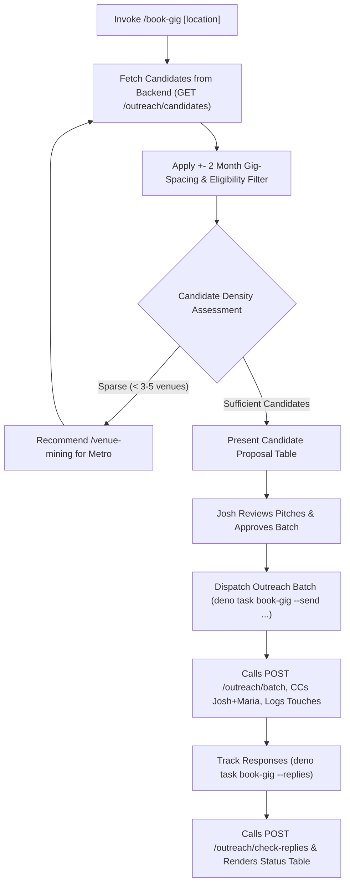

# book-gig — Target Performance Weekend Booking Outreach

Automate identifying eligible live-music venues, filtering them against Josh & Maria's performance history (+- 2 months gig-spacing), triggering `venue-mining` when target density is low, generating personalized booking pitches that adhere to `docs/cross-ai-rules.md` voice rules, dispatching approved batches via `POST /outreach/batch` (`--send`), and tracking live venue responses and AI suggestions (`--replies` / `--check-replies`).

## Invocation

- `/book-gig <weekend> [location]` — Discovery & preview mode (drafts pitches, logs candidate table, outputs clickable HTML artifact link, and automatically opens it in Chrome).
- `/book-gig --send "<weekend>" [location] [--venues "id1,id2"] [--skip "id3"]` — Batch dispatch mode (calls `POST /outreach/batch` to send pitches to approved venues, outputs HTML artifact link, and opens in Chrome).
- `/book-gig --replies [weekend]` — Response tracking mode (scans Gmail for replies via `POST /outreach/check-replies`, displays live campaign status table, outputs HTML artifact link, and opens in Chrome).
- `/book-gig --link-gig <venue-name>` — Gig linking mode (resolves single venue by exact normalized name, matches unlinked gig, and writes `venueId` via `PATCH /gig/:id` to correct a wrong new-versus-returning badge per D-26).
- **Location Syntax & Flags:**
  - Multi-city compound list: `deno task book-gig "Oct 16-18 and Lynchburg, Blacksburg, Martinsville, Salem, Roanoke, and surrounding areas"`
  - Explicit flag: `deno task book-gig "Oct 16-18 2026" --cities "Lynchburg, Blacksburg, Martinsville, Salem, Roanoke"`
  - Supports `--cities`, `--locations`, or `--location`.
- **Examples:**
  - `deno task book-gig "Oct 16-18 2026"` — sweep all venues across the regional driving radius (~3.5h from Salem, VA) and automatically open the Dark Mode HTML artifact in Chrome.
  - `deno task book-gig "Oct 16-18 and Lynchburg, Blacksburg, Martinsville, Salem, Roanoke, and surrounding areas"` — focus on target cities and their surrounding regional communities, excluding non-target metros.
  - `deno task book-gig "Oct 16-18 2026" --no-open` — generate pitches and logs without automatically opening Chrome.
  - `deno task book-gig "Oct 16-18 2026" "Lynchburg, VA"` — focus on Lynchburg, VA and surrounding area.
  - `deno task book-gig --send "Oct 16-18 2026" "Lynchburg, VA"` — dispatch outreach batch to all eligible Lynchburg venues.
  - `deno task book-gig --send "Oct 16-18 2026" "Lynchburg, VA" --venues "id1,id2"` — dispatch only to specific approved candidate venues.
  - `deno task book-gig --send "Oct 16-18 2026" "Lynchburg, VA" --skip "id3"` — dispatch batch while excluding specific venues.
  - `deno task book-gig --replies "Oct 16-18 2026"` — check replies and campaign status for target weekend.
  - `deno task book-gig --replies` — check all active outreach campaigns across all target dates.
  - `deno task book-gig --link-gig "Olde Salem Brewing"` — link matching gig to venue by exact normalized name.
- **Interactive Fallback:** If invoked without arguments (`/book-gig`), prompt Josh interactively for the target weekend and optional location.

## Workflow

### 1. Resolve Target Weekend & Location
- Parse natural date ranges (`Oct 16-18 2026`) or ISO strings (`2026-10-16`).
- Parse optional location (City/State e.g. `Lynchburg, VA`, Zipcode e.g. `24502`, or metro slug).

### 2. Candidate Discovery & Gig-Spacing Exclusion
- Calls `web-jam-back` `GET /outreach/candidates?targetDates=...`:
  - Automatically filters to `outreachEligible !== false` venues with valid contact email.
  - Excludes venues that already have active outreach campaigns for the requested weekend.
  - Enforces the **+- 2 month gig-spacing rule** (`excludeUpcomingGigVenues`): excludes any venue where Josh & Maria are performing within 60 days of the target weekend.
  - Sorts and prioritizes venues matching the requested City, State, or Zipcode.

### 3. Density Check & Venue Mining Trigger
- If candidate coverage in the target area is sparse (< 3–5 venues), the skill offers to run `/venue-mining metro <slug>` to harvest net-new venues first.
- New venues are added to MongoDB with verified street addresses and booking emails via `POST /venue`.

### 4. Propose Candidate Table & Pitch Preview
- Present a phone-readable table to Josh in chat:
  `| # | Venue Name | City, State | Booking Email | Spacing Reason |`
- Generates personalized emails strictly conforming to `docs/cross-ai-rules.md` **Voice Rules**:
  - First-person singular ("I", "my wife Maria", "my wife and I play as Josh and Maria, an acoustic duo out of Salem, VA").
  - Salutation: `Hi,` or `Hi [Name],` (never "Dear [Title]").
  - Zero banned marketing hype words (`exciting`, `opportunity`, `passionate`, `thrilled`, `reach out`, `circle back`, `truly admire`, `deep connection`, `great addition`, `perfect fit`, `your spot`).
  - Warm coffee-shop conversational tone.
  - Preserves personal hooks (e.g. "son lives in Rustburg" or past performance note).

### 5. Approved Batch Outreach Dispatch (`--send`)
- Once candidate selection is approved, execute batch outreach dispatch:
  - **All eligible candidates:** `deno task book-gig --send "<weekend>" [location]`
  - **Specific approved subset:** `deno task book-gig --send "<weekend>" [location] --venues "id1,id2"` (or `--include`)
  - **Excluding specific candidates:** `deno task book-gig --send "<weekend>" [location] --skip "id3"` (or `--exclude`)
- Calls `POST /outreach/batch` on `web-jam-back` with `{ venueIds, targetDates, targetWeekend }`.
- Dispatches pitch emails to candidate booking contacts, CCs Josh and Maria (`joshua.v.sherman@gmail.com`, `chemmariasherman@gmail.com`), initializes active campaigns in MongoDB (`status: 'sent'`), and logs email touches on venue timelines.

### 6. Live Response Tracking (`--replies` / `--check-replies`)
- Track replies and campaign progression:
  `deno task book-gig --replies [target-weekend]`
- Calls `POST /outreach/check-replies` on `web-jam-back` to perform Gmail IMAP reply detection.
- Fetches pending replies (`GET /outreach/replies/pending`) and active campaigns (`GET /outreach`), rendering a status table with live lifecycle badges (`sent`, `replied`, `interested`, `booked`, `not-interested`, `no-response`, `target-filled`), sent dates, and response snippets.
- Highlights pending AI suggestions for review (`intent`, `confidence`, `suggestedAction`).
- **Responsive Dark Mode HTML Artifact & First-Party URLs:** Automatically generates and updates standalone Dark Mode `.html` review artifacts in `~/Dropbox/web-jam-llms/gig-outreach/`, publishes to `web-jam-back` via `POST /outreach/report` to serve from first-party `https://www.web-jam.com/outreach/report/<weekend>` URLs, outputs both the live web-jam.com URL and direct clickable `file://` link in chat / terminal logs, and automatically launches Google Chrome in the background to display the artifact immediately on completion (with `--no-open` supported for headless/CI runs).

## What It Refuses to Do

| It refuses to | Because |
|---|---|
| Auto-send outreach without explicit `--send` approval or dispatch to unapproved venues | Discovery mode generates previews and drafts for review first. Batch dispatch requires `--send` and supports explicit venue selection (`--venues`, `--skip`) so unapproved candidates are never pitched. |
| Pitch venues within +- 2 months of a booked gig | Preserves local audience draw and venue spacing commitments. |
| Pitch venues with active outreach campaigns for that weekend | Prevents embarrassing duplicate outreach to venue managers. |
| Use corporate marketing copy or banned hype words | Violates cross-AI voice rules. Tone must remain genuine and personal. |
| Invent unverified claims or musical genres | Anti-hallucination rule: only state facts given by Josh. |

