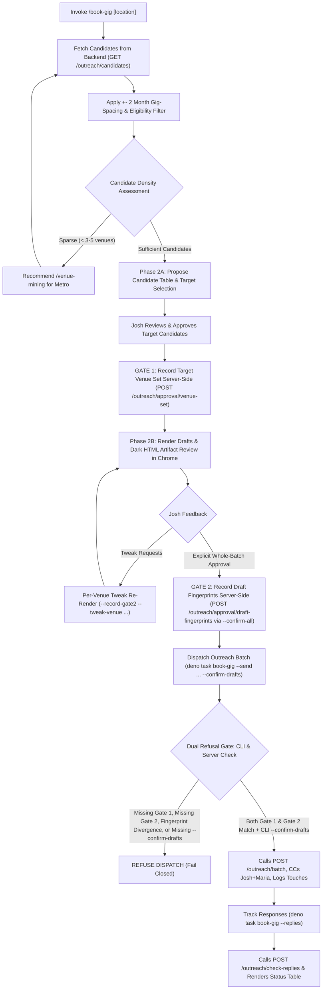

# book-gig — Target Performance Weekend Booking Outreach

Automate identifying eligible live-music venues, filtering them against Josh & Maria's performance history (+- 2 months gig-spacing), triggering `venue-mining` when target density is low, generating personalized booking pitches adhering to `docs/cross-ai-rules.md` voice rules, recording Gate 1 venue-set approval (`POST /outreach/approval/venue-set` via `--record-gate1`), holding the Gate 2 draft copy review loop and recording content fingerprints (`POST /outreach/approval/draft-fingerprints` via `--record-gate2`), dispatching approved batches via `POST /outreach/batch` (`--send --confirm-drafts`), and tracking live venue responses and AI suggestions (`--replies` / `--check-replies`).

## Invocation

- `/book-gig <weekend> [location]` — Discovery & preview mode (drafts pitches, logs candidate table, outputs clickable HTML artifact link, and automatically opens it in Chrome).
- `/book-gig --record-gate1 "<weekend>" [location] [--venues "id1,id2"] [--skip "id3"] [--approver "Josh"]` — Gate 1 venue-set approval mode (records server-side approval of the target venue set via `POST /outreach/approval/venue-set` once Josh approves the candidate table; authorizes ONLY the venue set and nothing else).
- `/book-gig --record-gate2 "<weekend>" [location] [--confirm-all] [--tweak-venue "<name>" --custom-body "<text>"] [--approver "Josh"]` — Gate 2 draft copy approval & review loop mode (holds review loop for individual venue tweaks via `--tweak-venue`, updates the HTML review artifact, and records server-side draft fingerprints via `POST /outreach/approval/draft-fingerprints` ONLY upon explicit affirmative whole-batch approval via `--confirm-all` or explicit batch signoff statement; authorizes ONLY draft copy and nothing else).
- `/book-gig --send "<weekend>" [location] --confirm-drafts [--venues "id1,id2" | --venue "id1"] [--skip "id3"]` — Batch dispatch mode (calls `POST /outreach/batch` to send pitches to approved venues, outputs HTML artifact link, and opens in Chrome; refuses unless BOTH Gate 1 and Gate 2 approval records exist and match, AND `--confirm-drafts` is passed on the command line; `--venue <name|id>` acts as an alias for a single target venue in `--send` mode).
- `/book-gig --replies [weekend]` — Response tracking mode (scans Gmail for replies via `POST /outreach/check-replies`, displays live campaign status table, outputs HTML artifact link, and opens in Chrome).
- `/book-gig --link-gig <venue-name>` — Gig linking mode (resolves single venue by exact normalized name, matches unlinked gig, and writes `venueId` via `PATCH /gig/:id` to correct a wrong new-versus-returning badge per D-26).
- `/book-gig --hold "<venueId|venueName>" --until <YYYY-MM-DD>` — Contact hold mode (sets `resumeBooking` to resume date at UTC midnight via `PATCH /venue/:id`; also accepts `--resume`).
- `/book-gig --booked-through <YYYY-MM-DD> --venue "<venueId|venueName>"` — Booked-through availability mode (sets `bookedThrough` to target date at UTC 23:59:59.999Z via `PATCH /venue/:id`; accepts `--venue` or `--hold`).
- **Location Syntax & Flags:**
  - Multi-city compound list: `deno task book-gig "Oct 16-18 and Lynchburg, Blacksburg, Martinsville, Salem, Roanoke, and surrounding areas"`
  - Explicit flag: `deno task book-gig "Oct 16-18 2026" --cities "Lynchburg, Blacksburg, Martinsville, Salem, Roanoke"`
  - Supports `--cities`, `--locations`, or `--location`.
- **Examples:**
  - `deno task book-gig "Oct 16-18 2026"` — sweep all venues across the regional driving radius (~3.5h from Salem, VA) and automatically open the Dark Mode HTML artifact in Chrome.
  - `deno task book-gig "Oct 16-18 and Lynchburg, Blacksburg, Martinsville, Salem, Roanoke, and surrounding areas"` — focus on target cities and their surrounding regional communities, excluding non-target metros.
  - `deno task book-gig "Oct 16-18 2026" --no-open` — generate pitches and logs without automatically opening Chrome.
  - `deno task book-gig "Oct 16-18 2026" "Lynchburg, VA"` — focus on Lynchburg, VA and surrounding area.
  - `deno task book-gig --record-gate1 "Oct 16-18 2026" "Lynchburg, VA" --venues "id1,id2"` — record Gate 1 target venue-set approval for specific approved candidate venues.
  - `deno task book-gig --record-gate1 "Oct 16-18 2026"` — record Gate 1 target venue-set approval for all eligible candidate venues.
  - `deno task book-gig --record-gate2 "Oct 16-18 2026" "Lynchburg, VA" --confirm-all` — record Gate 2 draft copy approval server-side with fingerprints upon explicit affirmative whole-batch approval.
  - `deno task book-gig --record-gate2 "Oct 16-18 2026" --tweak-venue "Olde Salem" --custom-body "Hi folks..."` — apply individual venue tweak, re-render into review artifact, and hold Gate 2 review loop.
  - `deno task book-gig --send "Oct 16-18 2026" "Lynchburg, VA" --confirm-drafts` — dispatch outreach batch to all approved venues after reviewing and confirming drafts.
  - `deno task book-gig --send "Oct 16-18 2026" "Lynchburg, VA" --confirm-drafts --venues "id1,id2"` — dispatch only to specific approved candidate venues after reviewing and confirming drafts.
  - `deno task book-gig --send "Oct 16-18 2026" "Lynchburg, VA" --confirm-drafts --venue "Twin Creeks"` — dispatch outreach to a single candidate venue (convenient alias for `--venues`).
  - `deno task book-gig --send "Oct 16-18 2026" "Lynchburg, VA" --confirm-drafts --skip "id3"` — dispatch batch while excluding specific venues.
  - `deno task book-gig --replies "Oct 16-18 2026"` — check replies and campaign status for target weekend.
  - `deno task book-gig --replies` — check all active outreach campaigns across all target dates.
  - `deno task book-gig --link-gig "Olde Salem Brewing"` — link matching gig to venue by exact normalized name.
  - `deno task book-gig --hold "Tequila's" --until 2027-01-01` — place contact hold on venue until Jan 1, 2027 (`resumeBooking`).
  - `deno task book-gig --venue "Olde Salem Brewing" --booked-through 2026-12-31` — record calendar booked solid through Dec 31, 2026 (`bookedThrough`).
  - `deno task book-gig --hold "Olde Salem Brewing" --until 2027-01-01 --booked-through 2026-12-31` — record both contact hold and booked-through date simultaneously.
- **Interactive Fallback:** If invoked without arguments (`/book-gig`), prompt Josh interactively for the target weekend and optional location.

## Workflow

### 1. Resolve Target Weekend & Location
- Parse natural date ranges (`Oct 16-18 2026`) or ISO strings (`2026-10-16`).
- Parse optional location (City/State e.g. `Lynchburg, VA`, Zipcode e.g. `24502`, or metro slug).

### 2. Candidate Discovery & Gig-Spacing Exclusion
- Calls `web-jam-back` `GET /outreach/candidates?targetDates=...`:
  - Automatically filters to `outreachEligible !== false` venues with valid contact email.
  - Excludes venues that already have active outreach campaigns for the requested weekend.
  - Enforces the **+- 2 month gig-spacing rule** (`excludeUpcomingGigVenues`): excludes any venue where Josh & Maria are performing within 60 days of the target weekend.
  - Sorts and prioritizes venues matching the requested City, State, or Zipcode.

### 3. Density Check & Venue Mining Trigger
- If candidate coverage in the target area is sparse (< 3–5 venues), the skill offers to run `/venue-mining metro <slug>` to harvest net-new venues first.
- New venues are added to MongoDB with verified street addresses and booking emails via `POST /venue`.

### 4. Two-Stage Approval Gate: Gate 1 (target venue set approval) & Gate 2 (draft email review loop and content fingerprint approval)

Batch outreach dispatch is protected by two mandatory, independent, non-fungible hard gates (D-39, D-40, D-41, D-45): Gate 1 (target venue set approval) and Gate 2 (draft email review loop and content fingerprint approval). AI assistants on all surfaces must strictly distinguish between target venue selection and draft copy approval:

#### Phase 2A: Target Venue Set Approval & GATE 1 Recording
- Present candidate proposal table to Josh in chat:
  `| # | Venue Name | City, State | Booking Email | Spacing Reason |`
- Josh reviews candidate eligibility and approves or refines the target venue list (e.g. approving specific IDs with `--venues` or skipping with `--skip`, or approving all proposed candidates).
- **GATE 1 RECORDING:** Immediately upon receiving Josh's approval of the target candidate list, the AI assistant MUST record Gate 1 approval server-side:
  - CLI: `deno task book-gig --record-gate1 "<weekend>" [location] [--venues "id1,id2"] [--skip "id3"] [--approver "Josh"]`
  - Client API: `recordGate1Approval({ weekend, venueIds, approver: "Josh" })` calling `POST /outreach/approval/venue-set` on `web-jam-back`.
  - Payload: `{ batchId, weekend, targetWeekend, venueIds, approver, notes, metadata }`.
- **STRICT HARD GATE INVARIANTS (D-39 / D-41):**
  - **Gate 1 authorizes ONLY the target venue set and NOTHING else.**
  - Recording Gate 1 approval does **NOT** authorize draft pitch copy and does **NOT** authorize email dispatch.
  - Approval of draft copy or permission to send must **NEVER** be inferred from candidate list approval or Gate 1 recording.
  - **No Silent Re-Recording (D-54):** The backend upserts Gate 1 approval records on batchId/weekend, so a re-run rewrites whatever is stored. `--record-gate1` therefore classifies the requested set against the stored one and has exactly four outcomes:
    1. **No prior approval, or an identical set** — recorded. The identical case is a harmless idempotent no-op (e.g. a notes/approver touch-up).
    2. **A widening** — every stored venue is still present and at least one was added. The set is re-recorded **as a whole**, and the run prints the stored set beside the new one before writing so the change is visible. Dispatch then reaches only the venues in the approved set carrying no outreach record for that weekend, so widening never re-mails an already-pitched venue: approving eight, pitching them, and later adding five sends five emails.
    3. **A non-widening difference** — a stored venue was removed or replaced. **Refused**; nothing is recorded. Re-run with every stored venue still present, or use a different batch.
    4. **The lookup could not determine which applies** — a non-2xx status, an unparseable body, an expired token, or a dropped connection. **Refused (fails closed)**; no POST is made. A lookup that returns nothing and a lookup that could not run are indistinguishable to the caller, so treating the second as "no prior approval exists" would silently replace an approval through the backend's upsert on the weekend key.
    There is no flag that overrides any of this; no `--re-record` exists.
  - **FORBIDDEN ACTION:** AI assistants are **STRICTLY FORBIDDEN** from executing `deno task book-gig --send` when the user approves target candidates or when Gate 1 is recorded. Gate 1 satisfies only the venue-set check; dispatch requires both Gate 1 and an independent Gate 2 draft copy approval record.

#### Phase 2B: Pitch Copy Review Loop & GATE 2 Recording
- Provide the generated pitch previews and clickable Dark Mode HTML review artifact link (automatically opened in Chrome) so Josh can inspect the exact rendered pitch emails:
  - Subject lines, salutations, body copy, and venue contact details.
  - Verification that email drafts strictly conform to `docs/cross-ai-rules.md` **Voice Rules**:
    - First-person singular ("I", "my wife Maria", "my wife and I play as Josh and Maria, an acoustic duo out of Salem, VA").
    - Salutation: `Hi,` or `Hi [Name],` (never "Dear [Title]").
    - Zero banned marketing hype words (`exciting`, `opportunity`, `passionate`, `thrilled`, `reach out`, `circle back`, `truly admire`, `deep connection`, `great addition`, `perfect fit`, `your spot`).
    - Warm coffee-shop conversational tone.
    - Preserves personal hooks (e.g. "son lives in Rustburg" or past performance note).
- **Template Divergence Check (D-50):** Every rendered email is checked against its stored `Template` record before artifact display or Gate 2 approval. Divergence outside declared placeholders refuses the batch. Per-venue customizations must travel through declared custom slots (`[Custom Intro]`, `[Custom Body]`).
- **Interactive Tweak Loop (D-44):** Gate 2 is an interactive review loop, not a single yes/no. Josh may request tweaks to individual emails (e.g. `deno task book-gig --record-gate2 "<weekend>" --tweak-venue "<name>" --custom-body "<text>"`). That one email is re-rendered into the artifact; other venues are untouched. The run holds at Gate 2 and does NOT record fingerprints.
- **What Closes Gate 2 (D-45):** Gate 2 closes ONLY on an explicit affirmative approval of every draft in the batch in its entirety, covering the full text of every email as finally rendered:
  - CLI: `deno task book-gig --record-gate2 "<weekend>" [location] --confirm-all` (or explicit whole-batch signoff statement in `--notes`).
  - In chat: Unambiguous affirmative approval of the whole set (e.g. "approve all drafts", "approve batch in full", "drafts look good, send them all").
- **What NEVER Closes Gate 2 (Anti-Inference Invariant):**
  - Approval is **NEVER** inferred from the tweak loop going quiet or silence.
  - Approval is **NEVER** inferred from approving a single venue's wording ("Olde Salem looks good").
  - Approval is **NEVER** inferred from approving a sample, subject lines, or summary.
  - Approval is **NEVER** inferred from passing remarks ("looks fine", "ok", "cool").
  - Approval is **NEVER** inferred from Gate 1 / candidate list approval ("I approve the venue list").
  - Approval is **NEVER** inferred from negations, refusals, or questions ("do not approve drafts", "why would I approve?").
- **GATE 2 RECORDING:** Upon explicit whole-batch approval, SHA-256 content fingerprints of every rendered email draft are computed and recorded server-side:
  - CLI: `deno task book-gig --record-gate2 "<weekend>" [location] --confirm-all [--approver "Josh"]`
  - Client API: `recordGate2Approval({ weekend, approver: "Josh", draftFingerprints })` calling `POST /outreach/approval/draft-fingerprints` on `web-jam-back`.
  - **Invalidation:** Any subsequent tweak to copy or venue set breaks the fingerprints and invalidates the approval, re-opening Gate 2.
  - **Independence (D-39 / D-41):** Gate 2 authorizes copy and nothing else. Approving copy does not approve a venue set, and approving a venue set does not approve copy.

### 5. Approved Batch Outreach Dispatch & The Two Refusals (design Step 6 / D-39 / D-48)

Batch outreach dispatch is protected by two distinct, mandatory refusals operating in series:

1. **Command-Line Refusal (CLI Guard):**
   - The `--send` command strictly requires `--confirm-drafts` on the command line:
     - `deno task book-gig --send "<weekend>" [location] --confirm-drafts`
     - Optional venue filter: `--venues "id1,id2"` or `--venue "name"` or `--skip "id3"`
   - If `--confirm-drafts` is omitted, the CLI fails closed immediately before touching the network:
     > `Batch outreach dispatch requires explicit draft confirmation via --confirm-drafts.`
   - This prevents agent conflation at the invocation boundary.

2. **Server-Side Backend Refusal (API Guard):**
   - `POST /outreach/batch` on `web-jam-back` verifies both stored approval records against the incoming batch payload:
     1. **Both approvals present and matching:** A valid Gate 1 approval record exists for this batch/weekend, the batch's venues match the approved set (accounting for widened venues carrying no outreach record for that weekend), and a valid Gate 2 approval record exists whose stored fingerprints match the re-rendered drafts -> **batch sends**.
     2. **Either approval absent, or divergent:** Missing Gate 1 record, missing Gate 2 record, venue set mismatch, or any email draft diverging from its approved fingerprint -> **refuses the entire batch in full**. No partial sends: venues that still match are never dispatched on their own.
     3. **Lookup or comparison failure:** Cannot read approval records, network error, or verification failure -> **refuses (fails closed)**.
- **Strict Prohibition for AI Assistants:** AI assistants on all surfaces (Claude Code and agy/Antigravity) are **STRICTLY PROHIBITED** from executing `--send` based on venue list approval alone, without explicit whole-batch draft approval, or without `--confirm-drafts`.
- Dispatches pitch emails to candidate booking contacts, CCs Josh and Maria (`joshua.v.sherman@gmail.com`, `chemmariasherman@gmail.com`), initializes active campaigns in MongoDB (`status: 'sent'`), and logs email touches on venue timelines.

### 6. Live Response Tracking (`--replies` / `--check-replies`)
- Track replies and campaign progression:
  `deno task book-gig --replies [target-weekend]`
- Calls `POST /outreach/check-replies` on `web-jam-back` to perform Gmail IMAP reply detection.
- Fetches pending replies (`GET /outreach/replies/pending`) and active campaigns (`GET /outreach`), rendering a status table with live lifecycle badges (`sent`, `replied`, `interested`, `booked`, `not-interested`, `no-response`, `target-filled`), sent dates, and response snippets.
- Highlights pending AI suggestions for review (`intent`, `confidence`, `suggestedAction`).
- **Responsive Dark Mode HTML Artifact & First-Party URLs:** The database-served report at `https://www.web-jam.com/outreach/report/<weekend>` (via `POST`/`GET /outreach/report`) is the only durable copy — a second batch for the same weekend reads it back and merges into it. No file is ever written under `~/Dropbox/`. The run also writes the same rendered HTML to a disposable local scratch file purely so it can open immediately in Chrome; that file is never read back. Outputs both the live web-jam.com URL and the local `file://` link in chat / terminal logs, and automatically launches Google Chrome in the background to display the artifact (with `--no-open` supported for headless/CI runs).

## What It Refuses to Do

| It refuses to | Because |
|---|---|
| Auto-send outreach without explicit draft approval and `--confirm-drafts`, or dispatch based on venue target approval alone (Gate 1) | Two-stage approval gate requires distinct signoff (D-39): Gate 1 authorizes ONLY the target venue set (recorded server-side via `POST /outreach/approval/venue-set`), while Gate 2 authorizes rendered draft copy (recorded server-side via `POST /outreach/approval/draft-fingerprints`). Dispatch requires `--send --confirm-drafts` and fails closed if either gate or `--confirm-drafts` is missing. AI assistants are strictly forbidden from executing `--send` when candidates or venue lists alone are approved. |
| Infer draft copy approval from silence, tweak requests, partial reviews, or venue list approval | D-45: Gate 2 closes ONLY on an explicit affirmative approval of the entire batch in its entirety. Tweak requests, passing remarks ("looks fine"), partial reviews ("venue 1 approved"), silence, negations/refusals, and venue-list approvals are strictly rejected as approvals. |
| Dispatch when rendered copy diverges from stored Template records | D-50: Every rendered email must match its stored Template record with substitutions strictly confined to declared placeholders. Any fixed prose divergence refuses the batch. |
| Dispatch when email drafts diverge from Gate 2 approved fingerprints | design Step 6 / D-39: `POST /outreach/batch` re-renders each draft and compares SHA-256 content fingerprints against Gate 2's stored record. Any mismatch refuses the entire batch in full (no partial sends). |
| Re-record a Gate 1 venue set that removes or replaces an already-approved venue | D-54 permits a *widening* (every stored venue kept, others added) and refuses anything else. A set that drops an approved venue is a replacement, not a revision, and the backend upserts on the weekend key, so it would silently discard what Josh approved. Nothing is recorded. |
| Record a Gate 1 or Gate 2 approval when the lookup could not be completed | D-54, fail closed. A non-2xx status, unparseable body, expired token, or dropped connection is indistinguishable from "no approval exists" to the caller, so proceeding would overwrite a prior approval through the backend's upsert on the strength of a failed network call. No POST is made. |
| Pitch venues within +- 2 months of a booked gig | Preserves local audience draw and venue spacing commitments. |
| Pitch venues with active outreach campaigns for that weekend | Prevents embarrassing duplicate outreach to venue managers. |
| Use corporate marketing copy or banned hype words | Violates cross-AI voice rules. Tone must remain genuine and personal. |
| Invent unverified claims or musical genres | Anti-hallucination rule: only state facts given by Josh. |
