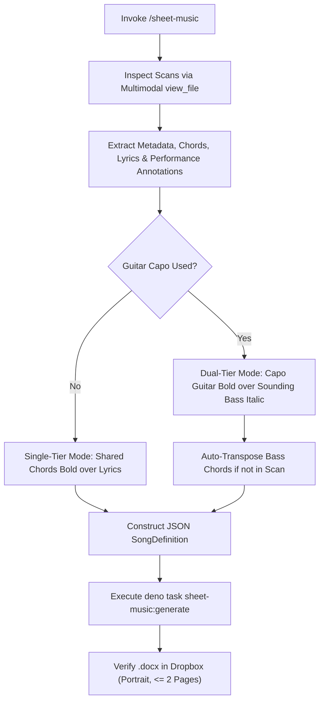

# sheet-music — Lead Sheet Transcription & Docx Reformatting

The `sheet-music` skill converts scanned lead sheet PDFs in Dropbox into clean, professional Word (`.docx`) lead sheets stored back in Dropbox. The skill accepts one or multiple Dropbox scan paths, consolidates chords and annotations, computes automatic semitone transpositions for bass guitar sounding chords when needed, renders chords over lyrics using monospace typography, and outputs a formatted portrait `.docx` lead sheet capped at 2 pages for music stands.

## Invocation

- `/sheet-music <Dropbox-path(s)...>` — Convert one or more scanned PDF files or a Dropbox folder into a consolidated `.docx` lead sheet.
- **Examples:**
  - `/sheet-music ~/Dropbox/joshandmariamusic/Mission/Narthex.pdf`
  - `/sheet-music ~/Dropbox/joshandmariamusic/Mission/Narthex.pdf ~/Dropbox/joshandmariamusic/Mission/Narthex-bassguitar.pdf "~/Dropbox/joshandmariamusic/Mission/Narthex-no capo.pdf"`
  - `/sheet-music ~/Dropbox/joshandmariamusic/Mission/`

## Workflow



### Steps

1. **Inspect Source Scans**: Read and visually inspect all supplied scanned PDF files in Dropbox using `view_file` (Flash High multimodal vision).
2. **Extract & Consolidate Musical Content**:
   - Extract title, songwriter/composer credits, copyright year, and tempo.
   - Detect Capo position (e.g. `Capo 2`) and base guitar chord shapes (e.g. `E`, `D`, `A`).
   - Extract or automatically transpose sounding bass chords (e.g. Capo 2 shifts `E` → `F#`, `D` → `E`, `A` → `B`).
   - Extract section structure (Verse, Chorus, Bridge, etc.), lyrics, and exact chord alignment over syllables.
   - Preserve performance markings (e.g. `[mp]`, `[soft]`, `[no bass]`, `[Add Maria w/ harm]`, `[last time]`).
3. **Harmonic Configuration**:
   - **Dual-Tier Layout**: When guitar uses a capo, render Line 1 = Guitar Capo Chords (**Bold**), Line 2 = Bass No-Capo Chords (*Italic*), Line 3 = Lyrics (Regular).
   - **Single-Tier Layout**: When guitar and bass share the same chords without a capo, render Line 1 = Chords (**Bold**), Line 2 = Lyrics (Regular).
4. **Generate Word Deliverable**:
   - Construct the structured `SongDefinition` JSON.
   - Write to a temporary file in `/tmp/` (e.g. `/tmp/song-input.json`).
   - Run the Deno generator:
     ```sh
     deno task sheet-music:generate --input /tmp/song-input.json --output /home/joshua/Dropbox/.../SongName.docx
     ```
5. **Verify & Report**: Confirm the `.docx` document is saved in the source Dropbox folder, verifies it fits within 2 pages in portrait orientation, and present the file path to the user.

## Formatting & Printing Rules

- **Portrait Orientation & 2-Page Budget**: Output documents are strictly formatted in portrait mode with compact 0.5-inch margins (720 dxa) to guarantee they never exceed 2 pages.
- **Monospace Alignment**: Chords and lyrics use `Consolas` monospace font (10.5pt–11pt) so character columns align 1:1.
- **Spacebar / Backspace Editability**: Generated documents use standard paragraph lines so human editors can easily adjust chord positions in Microsoft Word or Google Docs using the Spacebar and Backspace keys.
- **Black & White Printout Styling**:
  - Guitar Capo Chords (or Shared Chords): **Bold**
  - Bass No-Capo Chords: *Italic* (no parentheses)
  - Lyrics: Plain Regular
  - Header Legend: Clear instrument legend explicitly stating `Guitar (Capo <N>): Bold | Bass Guitar (No Capo): Italic`.
